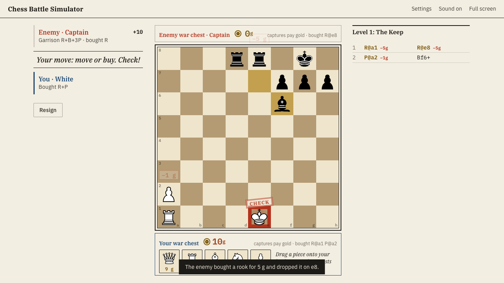

# Chess Battle Simulator

**Chess where gold is your army. Start with a lone king and a purse, and build your side one purchase at a time, in the middle of the fight.**

A week-3 prototype for NYU Game Design. There is no setup phase. Each turn you either make a normal chess move **or buy one piece** (Queen 9, Rook 5, Bishop 3, Knight 3, Pawn 1) and drop it on an empty square of your back two ranks. Every capture pays a bounty back into your purse. The enemy shops by the same rules. Your war chest sits right under the board, and you drag pieces from it onto the board.

- **Play online:** https://stevenli-phoenix-work.itch.io/chass
- **Play locally:** `pnpm install && pnpm dev`, then open http://localhost:5173 (designed for a 1280×720 desktop window; also works on phones).

## Modes

| Mode | What happens |
|---|---|
| **Level 1 "The Keep"** | Your lone king on e1 with **16 gold** vs a garrison that is already on the board (K g8, R d8, B e7, P f7 g7 h7) **with 5 gold of its own** to reinforce with. Enemy AI plays at *Captain* strength. Buy, fight, earn, and checkmate it. |
| **Free battle** | Two lone kings, the same purse each (8 / 12 / 20 / 39). Play the computer (Recruit / Captain / Warlord) or a friend on the same device. |
| **Demo: AI vs AI** | Two AIs start from lone kings with the same purse and build their armies during the game. The only difference between them is search depth (e.g. Warlord, 4 plies, vs Recruit, 1 ply). It plays itself with a running score, commentary for each move (depth, positions searched, what it bought, mates seen) and an evaluation bar. It shows the strategy ladder directly: thinking further ahead buys and plays better. |
| **Settings** | Sound, legal-move dots, coordinates, animations, **effects (Full / Subtle / Off)**, campaign AI strength, the *capture bounty* house rule (the rule and the effects level are recorded with every session), and a Privacy switch for anonymous telemetry sharing. |
| **Playtest data** | Every session is recorded locally: win rate per purchased army, what players buy, how games end, a learning curve, and the full PGN. Export JSON/CSV, import files from other testers, and see whether anonymous sharing is currently on. |

**Rules:** normal chess (via chess.js) with no castling, plus the shop. On your turn, instead of moving, you may buy one piece and drop it on an empty square of ranks 1–2 (pawns on rank 2 only; they can still double-step). Buying is your move, so it costs a tempo. You may own at most one standard set's worth of each piece on the board (1 Q, 2 R, 2 B, 2 N, 8 P). A drop may not leave your king in check, and it *can* block a check, so you are only mated when no move and no purchase saves you. Captures pay pawn/knight/bishop 1 g, rook 2 g, queen 4 g. Checkmate wins; stalemate, threefold repetition and the 50-move rule are draws. It is not a draw by "insufficient material" while someone can still afford a piece.

## Strategic depth: characteristics used (Lecture 3)

| Characteristic | In this game |
|---|---|
| **Stochasticity** | Deterministic rules, no dice. The only randomness is the AI choosing among near-equal moves, so games vary without luck deciding them. |
| **Observability** | Perfect information. Both purses, the enemy garrison and every purchase are visible (the enemy's war chest sits above the board). |
| **Time granularity** | Turn-based with no clock. Every turn poses one question: move or buy, and if buy, what and where. |
| **Length of playtime** | A *round* is one battle. A *session* is several attempts at the level, trying different spending plans. The *full game* would be a campaign of levels; this prototype has one. |
| **Systems** | *Resources*: gold turns into pieces, but only one per turn, so tempo is the real currency. *Feedback loop*: captures pay bounties, so winning material earns more gold (positive loop), while the side behind can still buy blockers. *Combination*: pieces support each other (rook + queen batteries, the bishop pair, pawn shields). *Conditional*: drop rules (pawns only on rank 2; a drop can't leave your king in check but can block one). |
| **Single vs multiplayer** | *One-and-a-half player* in the campaign (you vs a non-trivial AI that also shops). Competitive local multiplayer in the hotseat free battle. |
| **Dexterity vs strategy** | Zero dexterity, all strategy: planning purchases, timing them, and deciding where to drop. |
| **Depth vs entropy** | Chess is deep but mostly learned by rote. Starting from empty ranks with a purse means no two games open alike, while piece prices give a useful compression (not a solution) for buying. The demo shows the strategy ladder: more search, better results. |

## Heuristics players learn

These are the rules of thumb we expect players to discover. The telemetry exists to check whether they actually do (see the learning curve and the per-army win rates in *Playtest data*).

1. **Buy the threat first, then the shield.** An early heavy piece (a queen or rook) gets the enemy reacting to you. But a lone king with a queen still needs something to mate with, and cover for its own back rank.
2. **Tempo is the real price.** Every purchase costs a move. Buying three pawns costs three turns, which a developed garrison can use to attack. Price in gold ≠ price in time.
3. **Buy where it matters, when it matters.** Gold in the chest is flexible: you can drop a blocker on the exact square a check needs, or a defender next to the king. Spend too early and you lose that answer; spend too late and you're outnumbered.
4. **Trades pay.** Every capture refills your purse, so even trades turn into new pieces. When you're ahead, trade down and rebuy where you want them.
5. **Aim at the weakness you can see.** The Keep's king sits behind f7-g7-h7 with no escape square, a back-rank target, and its only defender is the rook on d8. Heavy pieces on open files break it.
6. **Don't drop into a fork or a pin.** Your back two ranks are close to your king; a new piece on the wrong square becomes a target for the enemy bishop's diagonal or the d-file rook.
7. **Can this army actually checkmate?** You only win by mate. Keep enough gold or material for a mating force; a lone minor piece can't force it.

A good heuristic, per the lecture, applies at every stage, sits between gut feeling and brute force, and compresses the game state. "Tempo is the real price" and "buy where it matters" apply from move one to the final mating net.

## Game feel (Lecture 2)

Chess is turn-based and quiet, and the lecture's *Compare* slides (Pokémon vs Final Fantasy 7) make the point that turn-based games need juice too. We took the maximalist route with one rule of our own: **every effect has to say something about the game state** (the economy, a threat, or the weight of a move), and it has to be made of the book's own materials: ink, rubber stamps, brass coins and paper. There are no glows or gradients. The rules, the AI and the balance are untouched: the match state changes instantly, and the effects only *show* it.

| Lecture principle | What it became here | Why |
|---|---|---|
| **Game feel = input → response, in context** (Swink) | A picked-up piece or card **lifts** with a hard print shadow and **tilts** with your hand's speed. The square it will land on is outlined while you drag, and a rejected drop **snaps back** to where it came from. | Responsiveness: the game answers the hand before the move is made. |
| **Metaphor** (Swink's ingredients) | A capture leaves **ink spatter in the attacker's colour**, a purchase lands with a **printer's registration mark**, check is **stamped** next to the king, mate is a **big rubber stamp** across the board, and the verdict in the result dialog is stamped too. | The book aesthetic becomes the feedback language instead of a skin under it. |
| **Screen shake** ("wow, something really happened") | The board column shakes on captures, **scaled by the price of the piece taken** (a pawn is a nudge, a queen a jolt, mate the biggest). Quiet moves never shake. | Shake *means* material, so a player learns the size of a trade without reading the score. |
| **Tweening, easing, Disney's principles** | Moves have **anticipation** (the piece lifts and pulls back), **slow in/out** travel scaled by distance, **follow-through** (it overshoots and settles) and a **squash** on landing. Purchases are **stamped down** from above. The captured piece stays until it is hit, then gets **knocked off** (secondary action). The losing king **wobbles, then topples**. | Weight: a wooden piece set down hard, and a move you can follow with your eye, including the AI's. |
| **Hit-stop** (Vlambeer's *Art of Screenshake*) | On rook/queen captures the attacker **freezes for 70 ms on impact**. On mate it freezes for 240 ms, and then the stamp lands. | The biggest moments get a beat of silence before the reaction. |
| **Particles** (dust, comic punch, spatter, confetti) | Ink rings and spatter, **coins**, and **paper-chip confetti** when you win. | Particles carry information: coins are gold, and ink colour tells you who struck. |
| **Sound** | Synthesized per event (`src/ui/sound.js`): a wooden **thock** for moves, a **capture thud that deepens with the piece's value**, a **stamp** for purchases, coins that **clink up the scale** as they are counted, and a big thud on mate. | The ear gets the same scale as the eye: value maps to pitch and weight. |
| **Screen flash + sound** (GoldenEye) | Illegal drops flash the square red, shudder and buzz. The checked king's square **pulses**. | Threat and error are unmistakable, even for a glance. |
| **Health-bar tricks** (warping, damage trails) | The economy is animated honestly: **coins fly from a capture into the capturer's purse**, and the counter **ticks up one coin at a time**. A purchase pays out of the purse coin by coin onto the square. The demo's eval bar leaves a **hatched trail** showing how far the evaluation just swung. | The purse lags for under a second and always lands on the true total. We rejected *warping*, *rubberbanding* and *last-bullet* luck because they would lie about, or bend, the state of a perfect-information strategy game. |
| **Coyote time / Cannabalt's generous hitbox** | **Drop forgiveness:** a card released just off the board edge (the gap above your war chest) snaps to the nearest legal square within 0.6 of a square, and the preview shows it first. | This is forgiveness in *input* only. What is legal never changes. |
| **"Make losing fun"** | The loser's king topples, and the defeat is stamped rather than just printed. | A loss still has its moment. |
| **Maximalism vs "slopping it up"** | There is a lot of feedback, but it can be tuned (every number is in `FEEL` in `src/config.js`) and **tested**: *Settings → Effects: Full / Subtle / Off*. Each session records `feel: { effects, effective, sound }`, so playtest data can compare win rate, game length and retention per feel level. | The lecture says to decide for yourself and play your own game, so the data judges whether maximalism helps here, not our taste. |

*Subtle* keeps the information (coins, capped at 3 per event; ink rings; the end-of-game stamp; smaller shakes) and drops the drama (no hit-stop, tilt, spatter, check stamp or confetti). *Off*, and also *Animations off* or the OS "reduce motion" setting, shows no motion effects at all, and the purse is exact immediately. Nothing waits on an effect: moves and purchases apply instantly and the effect layer never takes input. Only the result dialog waits, about 1.5 s, so the mate stamp can land first. Code: `src/ui/feel.js` (pure shapes and timings, unit-tested), `src/ui/fx.js` (the DOM layer over the board), `src/ui/board.js` (piece motion), `src/ui/sound.js` (synth recipes).

## Balancing & telemetry

Balancing is the hard part, so the prototype ships with two tools for it:

- **Playtest telemetry (in the game).** Each session records: mode, level, AI level, starting gold, attempt number, the house rules in force, the game-feel level (`feel`), both sides' start (placement, gold), every purchase (`drops`: ply, piece, square, cost), what each side bought in total (`bought`), start and final FEN, full PGN (drops written `N@b1`), a per-ply material timeline, and the result and end reason (checkmate, resign, stalemate, threefold, 50-move, insufficient, abandoned). Records carry `balanceVersion` (currently `b5`) so data from different rule sets can be separated.
  - **Where it goes:** local-first, always. Data lives in the browser's localStorage, and nothing is ever sent off the device without an explicit choice — see **Consent & privacy** below. Any tester can click **"Download your play data"** on the result screen and send you the JSON; you **Import** it on the Playtest data screen, which dedupes by session id.
- **AI-vs-AI simulator:** `pnpm sim -- --gold 14,16 --enemy-gold 3,5 --games 30` plays Level 1 with an AI standing in for the player (both sides shop) and prints win/draw/loss, enemy purchases and first buys for every (player gold, enemy gold) pair. See [docs/balance-sim.md](docs/balance-sim.md).

### Consent & privacy

The first time the game runs, a card over the menu asks the player to opt in before anything leaves the device — declining (or just not deciding) means telemetry stays local-first exactly as above. The choice can be changed any time in **Settings → Privacy**, and the **Playtest data** screen always states whether sharing is currently on.

- **What's shared, if you opt in:** moves and purchases, results and timings, your settings/house rules, and a random player id generated on first run. **Never shared:** your name, account, IP address, cookies, or any cross-site tracking — the collector itself is built not to read or store IP/User-Agent/geo (see the comment at the top of `server/telemetry/src/index.js`).
- **Where it goes:** a small Cloudflare Worker + D1 database (`server/telemetry/`), deployed at `https://chass-telemetry.lishuyustevenli.workers.dev`. `TELEMETRY.endpoint` in `src/config.js` points at it; `src/telemetry/store.js` only POSTs a finished session when `settings.telemetryConsent === 'granted'` (via `sendBeacon`, falling back to `fetch(..., { keepalive: true })`).
- **Pulling collected data:** `pnpm telemetry:pull` (`tools/pull-telemetry.mjs`) downloads recent sessions into `telemetry-export-<date>.json` (gitignored) — same shape the dashboard's Import expects. It reads the read-token from `$CHASS_READ_TOKEN` or a local `.telemetry-read-token` file (gitignored, `chmod 600`, never committed).
- **Redeploying the collector:**
  ```bash
  cd server/telemetry
  PATH=/opt/homebrew/bin:$PATH npx -y wrangler@4 deploy   # wrangler 4 needs Node ≥22
  ```
  Schema changes go in a new `migrations/NNNN_*.sql` file, applied with `PATH=/opt/homebrew/bin:$PATH npx -y wrangler@4 d1 execute chass-telemetry --remote --file=./migrations/NNNN_*.sql`.

**Everything tunable lives in [`src/config.js`](src/config.js):** prices, caps, bounties, drop zones, king start squares, AI presets (search depth, quiescence, randomness window, time cap, how much the AI values unspent gold), the level (player gold, enemy garrison and enemy gold, AI preset) and free-battle purses. Bump `BALANCE_VERSION` when you change any of them.

## Look and feel

The interface is designed like a printed chess book: warm paper, black ink, hairline rules, IBM Plex Serif/Sans/Mono, one vermilion for the enemy and a deep ink-blue for you. There are no gradients, glows or rounded cards, and the menu is a contents page, where a printer's fist (☞) points at the chapter you hover. All colours and fonts live in `styles/tokens.css`; effect timings and sizes live in `FEEL` in `src/config.js` (see *Game feel* above).

## Project layout

```
index.html              entry (static; no build step needed to play)
src/config.js           ← all balance knobs
src/core/               rules: army (prices/caps/labels), placement (zones, FEN, start checks),
                        start (starting positions), game (Match: chess.js + shop, drops, bounty)
src/ai/                 search.js (alpha-beta + quiescence), evaluate.js, worker.js (Web Worker),
                        client.js, fastchess.js (the only file touching chess.js internals)
src/telemetry/          store (localStorage + export/import, opt-in remote send), session recorder, stats
src/settings.js         player settings + house rules + telemetry consent (persisted per browser)
src/ui/                 board component, sounds, consent card, game feel (feel.js: pure shapes/timings;
                        fx.js: ink, coins, stamps, shake), screens (menu, battle, free, demo, settings, dashboard, howto)
styles/                 tokens.css (design tokens) + main.css
vendor/chess.js         chess.js 1.4.0 (BSD-2), vendored
assets/pieces/          Cburnett SVG pieces (BSD-3)
tools/                  serve.mjs (dev server), build.mjs (dist/ for itch), simulate.mjs (balance sim), pull-telemetry.mjs
server/telemetry/       Cloudflare Worker + D1 telemetry collector (own package.json/wrangler.toml — not part of the game build)
tests/, e2e/            node:test unit tests (incl. the telemetry worker); Chrome smoke test via playwright-core
```

## Development

```bash
pnpm install         # dev deps only (chess.js pin for the vendor check, playwright-core)
pnpm dev             # http://localhost:5173  (add ?debug=1 for verbose console logs)
pnpm test            # unit tests (node:test)
pnpm test:e2e        # drives your installed Google Chrome headlessly; screenshots → e2e/artifacts/
pnpm sim -- --gold 16 --enemy-gold 5 --games 30   # balance simulator (flags documented at the top of tools/simulate.mjs)
pnpm telemetry:pull  # download opted-in playtest sessions from the collector → telemetry-export-<date>.json
pnpm build           # dist/ = the folder uploaded to itch.io (server/telemetry/ and any token file are never copied in)
```

### CI

Every push to `main` runs `pnpm test` and `pnpm build`, then publishes `dist/` to [itch.io](https://stevenli-phoenix-work.itch.io/chass) via [butler](https://itch.io/docs/butler/) tagged with the commit SHA (`.github/workflows/publish-itch.yml`). Can also be triggered manually from the Actions tab (`workflow_dispatch`).

The AI is a small alpha-beta search written for this game, not Stockfish. That way its strength can be tuned precisely, it handles any army (two queens, no pawns, …), and the simulator runs fast. It uses chess.js's internal move generator (about 40× faster than the public API); those internals are pinned by `tests/fastchess.test.js`.

## Credits

- Rules engine: [chess.js](https://github.com/jhlywa/chess.js) 1.4.0, BSD-2-Clause (`vendor/LICENSE-chess.js.txt`)
- Piece art: Colin M.L. Burnett ("Cburnett"), used under BSD-3-Clause (`assets/pieces/LICENSE.md`)
- Fonts: Cinzel, Inter, JetBrains Mono (Google Fonts, OFL)

---

## Assignment brief & original team notes

This Week’s Prototype
For next class: make a prototype that exhibits strategic depth.
In other words, the more you think about the game the better
you should do. Explain which characteristics you use and which
heuristics are learned.
Don’t go overboard on mechanics or scope!
This is difficult! Playtests with people outside your group
will help.
Use of AI: optionally, yet judiciously. Don’t lose control.

Genre: deck-building game

Issues:
Balancing will be very hard,
Need to have a working game, need to implement enemy AI - question do we want the enemy pieces set or do we want it to randomize each time?
limit where pieces can be placed
limit how many pieces can be bought
1 level to make
can have a free mode where both sides can purchase pieces
you wil generate the game using claude first, I will make edits after

Game Idea:
Chess Battle Simulator
Set levels where you can buy pieces on a chess board, you are given set amount of money to choose which pieces to buy
You are going against an enemy AI who has their ownpieces
You play chess regularly given the pices that you bought and try to checkmate that way

**How the prototype answers the open questions:** the Level 1 enemy garrison is **fixed and visible**, so the level can be learned and the thinking pays off; variety comes from the purchases, since no two games build the same armies. Where pieces can go is limited to your back two ranks (pawns on rank 2). How many can be bought is limited by gold, by one purchase per turn, and by a standard set's counts on the board. *(v0.4.0 removed the original pre-battle buying phase: all buying now happens during the battle.)*
